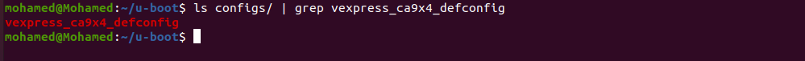
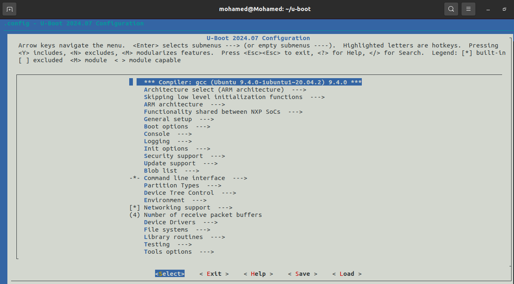
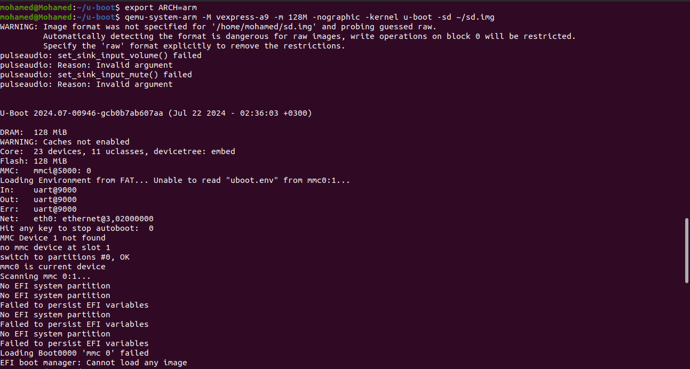
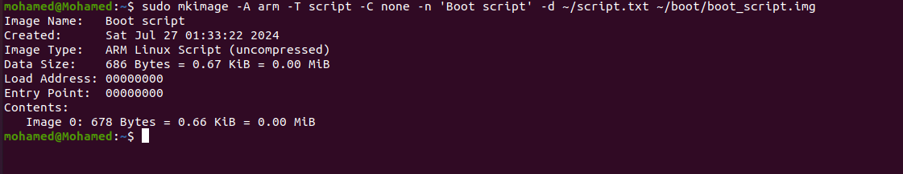
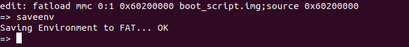
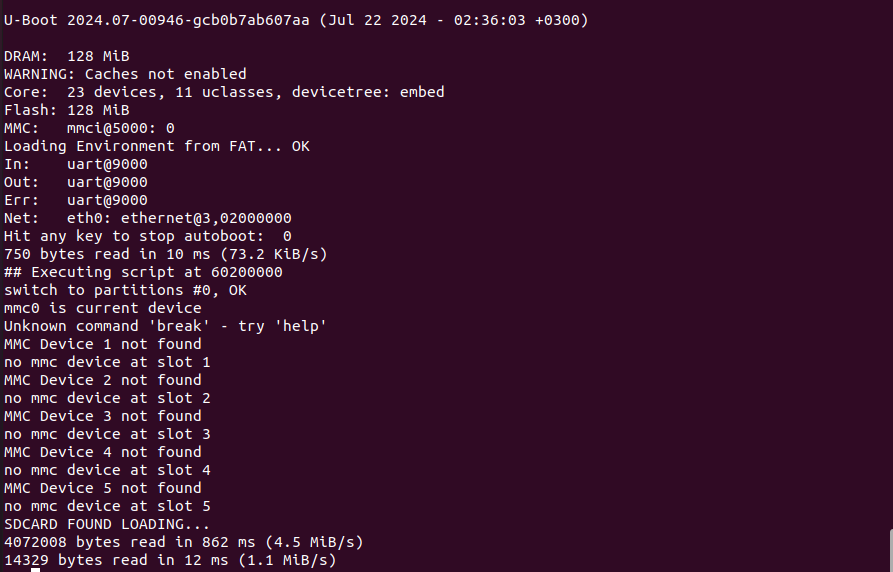
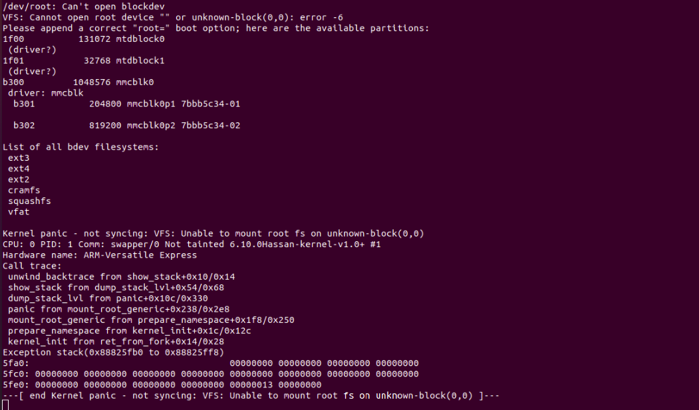

# U-boot (Bootloader) and Kernel

## 1. Install U-boot


#### 1.2. Cloning the U-boot Repository

```
git clone git@github.com:u-boot/u-boot.git
```


#### 1.3. U-boot Machine Configurations

```
ls configs/ | grep vexpress_ca9x4_defconfig 
```


Set the cross compiler into environment variables to enable the U-boot to use it


```
    export CROSS_COMPILE=/home/mohamed/x-tools/arm-cortexa9_neon-linux-musleabihf/bin/arm-cortexa9_neon-linux-musleabihf-
```

Use the default configurations of ARM Vexpress Cortex A9

  ```
  make vexpress_ca9x4_defconfig
  ```


##### 1.4. U-boot Configurations

```
make menuconfig
```



Support **bootd**.
Support **editenv** and **saveenv**.
Store the environment variable inside file call **uboot.env**.
Support **FAT file system**.
 Configure the partition where the fat is store to **0 : 1** .


##### 1.5. Build U-boot

```
make
```

## 2. Test *U-boot* over *Vexpress-a9* machine using *Qemu* emulator

#### 2.1. Install Qemu 


  ```
  sudo apt install qemu-system-arm
  ```


#### 2.2. Run ***qemu*** with Emulated SD card

```
qemu-system-arm -M vexpress-a9 -m 128M -nographic -kernel ~/u-boot/ -sd ~/sd.img
```



## 3. Bash script to load kernal from SD card or TFTP


```
setenv mmc_found 0
setenv mmc_target 0
setenv serverip 192.168.1.13
setenv ipaddr 192.168.1.14

for mmc_num in 0 1 2 3 4 5; do
    if mmc dev ${mmc_num}; then
        setenv mmc_found 1
        setenv mmc_target ${mmc_num}
        break
    fi
done

if test ${mmc_found} -eq 1; then
    echo "SDCARD FOUND LOADING..."
    fatload mmc ${mmc_target}:1 ${kernel_addr_r} zImage
    fatload mmc ${mmc_target}:1 ${fdt_addr_r} vexpress-v2p-ca9.dtb
elif ping ${serverip}; then
    echo "NETWORK CONNECTION FOUND LOADING..."
    tftp ${kernel_addr_r} ${serverip}:~/etc/srv/tftp/zImage
    tftp ${fdt_addr_r} ${serverip}:~/etc/srv/tftp/vexpress-v2p-ca9.dtb
else
    echo "NO OPTIONS"
fi

```
#### 2.2. mkimage

mkimage is a tool that prepares files, such as kernel images, device tree blobs, and ramdisk images, for use with U-Boot. It generates images with headers that include metadata required by U-Boot to properly load and execute them.

```
mkimage -A arm -T script -C none -n 'Boot script' -d ~/SCRIPT.txt ~/boot/boot_script.img

```



#### 2.3.now we need to make bootcmd load the script manually once autoboot called

once autoboot called bootcmd (firstscript of u-boot) we need the following



#### 2.3. load kernel 

After running script the kernel image loaded into Ram 




```
bootz $kernel_addr_r - $fdt_addr_r

```




    