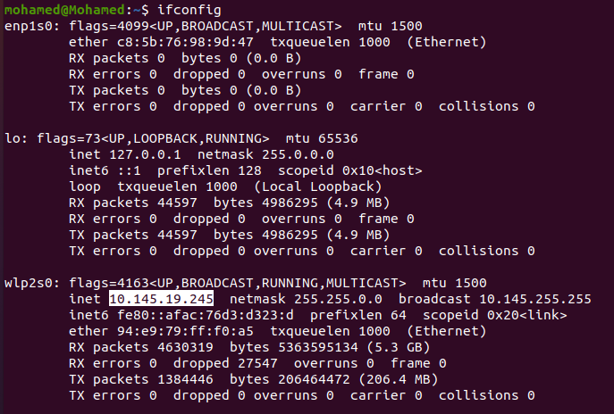
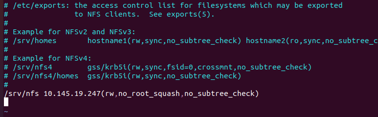
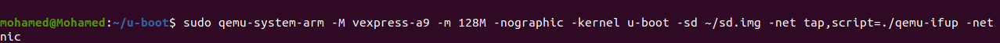
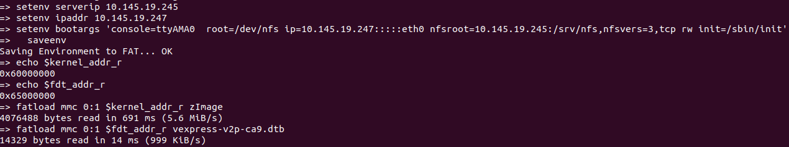
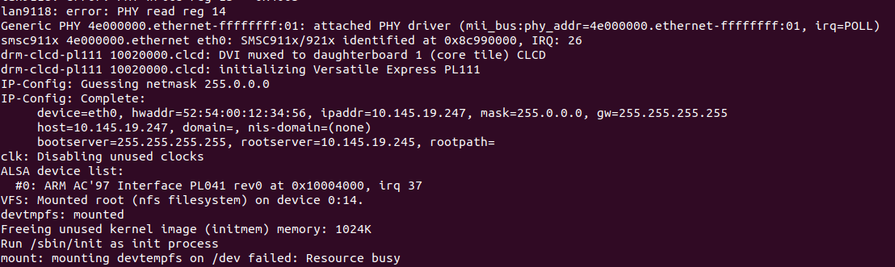

# Network File System NFS

### Install **NFS** Debian Package


```
sudo apt install nfs-kernel-server
```
- Check If **NFS** Installed successfully 

```
systemctl status nfs-kernel-server
```
### Mount Root File System through NFS server

- Make a directory under `/srv` called `nfs` 

```
sudo mkdir /srv/nfs
```
Copy Your **rootfs** in `/srv/nfs directory ` which will be my exported directory


  ```
  sudo cp -rp ~/rootfs_static/* /srv/nfs
  ```

  - To know your `IP Address ` of your host machine (Computer)

```
ifconfig
```


My network assigned IP_Address `10.145.19.245` to my computer , I will assign `10.145.19.247` to the Target (Qemu) 

- Configure the NFS file `/etc/exports` by add this line inside the file :


```
/srv/nfs 10.145.19.247(rw,no_root_squash,no_subtree_check)
```


- Open `/etc/exports` by vim :

  ```
  sudo vim /etc/exports
  ```




- Refresh the exports configuration file to update it by :

  ```bash
  sudo systemctl restart nfs-kernel-server
  ```
### Run Qemu

```
sudo qemu-system-arm -M vexpress-a9 -m 128M -nographic -kernel u-boot -sd ~/sd.img -net tap,script=./qemu-ifup -net nic

```


 Configure the IP addresses of Server (Computer) and Client (Qemu)

```
setenv serverip 10.145.19.245
setenv ipaddr 10.145.19.247
```


- Set **bootargs** variable 

```
setenv bootargs 'console=ttyAMA0  root=/dev/nfs ip=10.145.19.247:::::eth0 nfsroot=10.145.19.245:/srv/nfs,nfsvers=3,tcp rw init=/sbin/init'
  
```



- Load kernel and dbt file from SD card 

```
fatload mmc 0:1 $kernel_addr_r zImage
fatload mmc 0:1 $fdt_addr_r vexpress-v2p-ca9.dtb

bootz $kernel_addr_r - $fdt_addr_r
```


