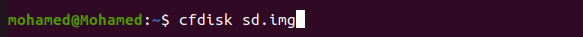
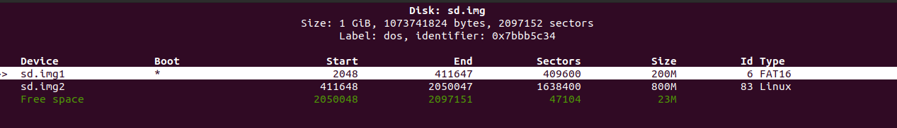
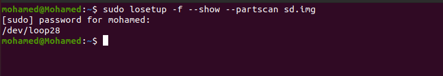
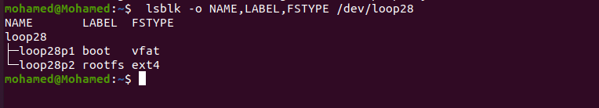

# virtual sd card 

## 1. the usage of virtual sd card 

virtual sd card is used with qemu.

virtual SD card image file is just a file on your hard disk it is the same as using real sd card with rasperrypi

## 2. Steps of creating virtual SD card

#### 2.1. Create a file called "sd.img" has a size of 1 GB

```
dd if=/dev/zero of=sd.img bs=1M count=1024
```

#### 2.2. Configure the Partitions Table of the Virtual SD card

```
cfdisk sd.img
```



Create the ***boot*** partition.

Select the Size of boot partition (200 M).

select file system type for boot partition ( ***FAT16*** ).

Make sure you select ***Bootable*** option for this partition. 

it should be ***primary*** type to make it bootable partition.

Create the ***rootfs*** (root file system) partition

Select the partition size 800M.

Select Linux file system type (Ext4).

should be extentend.




#### 2.3. Emulate the sd.img as a Storage Device (SD card)

##### 2.3.1. Loop Device Driver

The loop driver in Linux is a kernel module that allows a file to be  mapped as a block device. 

 ```
  sudo losetup -f --show --partscan sd.img
 ```





this command show the loop that is associated with my virtual SD card

 ```
losetup -a | grep loop28
 ```
  
We should format the  ***boot***  partition to be  ***FAT16***  

```
sudo mkfs.vfat -F 16 -n boot /dev/loop28p1
```

And the  ***rootfs*** to be ***Ext4*** type:

```
sudo mkfs.ext4 -L rootfs /dev/loop28p2
```

To make sure that the partitions formating done correctly, run this command :

  ```
  lsblk -o NAME,LABEL,FSTYPE /dev/loop28
  ```


  - Mount The Virtual SD Card
```
cd ~
mkdir boot 
mkdir rootfs
$ sudo mount /dev/loop28p1 ~/boot
$ sudo mount /dev/loop28p2 ~/rootfs
```


