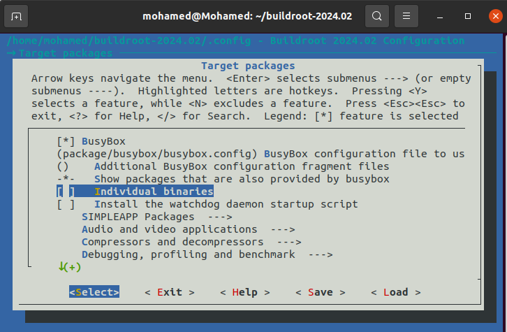

# Creating Buildroot package 

## Local Package

Suppose you have a personalized package named "simpleapp" that you want to add to your Root File System (Root FS) that you are creating with buildroot. In the simplest scenario, this package would include a source file and a makefile.

1) First, you need to set up the directory structure for your custom package:

```
mkdir -p ./package/simpleapp/src
```
This command creates a directory called simpleapp inside the package directory and another directory called src inside simpleapp. The src directory will contain your source files and Makefile.

2) Create Source Code

Create a simple C source file:

```
touch ./package/simpleapp/src/simpleapp.c

vim ./package/simpleapp/src/simpleapp.c

```

Inside simpleapp.c, write a basic C program:

```
#include <stdio.h>

int main(void) {
    printf("Hi People\r\n");
    return 0;
}
```
3) Create Makefile for Building the Application

Create a Makefile in the src directory:

```
touch ./package/simpleapp/src/Makefile

vim ./package/simpleapp/src/Makefile

```


```
.PHONY: clean
.PHONY: simpleapp

simpleapp: simpleapp.c
	$(CC) -g -Wall $(CFLAGS) $(LDFLAGS) $< -o $@

clean:
	-rm simpleapp

```
Explanation:

   - **.PHONY:**  Declares clean and simpleapp as phony targets, meaning they do not       represent  files but commands.
   - **simpleapp:** Target to build the application. Uses $(CC) (the C compiler) to compile simpleapp.c into an executable named simpleapp.
   - clean: Target to remove the compiled executable.

4) Create Package Definition File

Create a package definition file for Buildroot:

```
touch ./package/simpleapp/simpleapp.mk
vim ./package/simpleapp/simpleapp.mk

```

```
################################################################################
#
# simpleapp package
#
################################################################################

SIMPLEAPP_VERSION = 1.0
SIMPLEAPP_SITE = package/simpleapp/src
SIMPLEAPP_SITE_METHOD = local

define SIMPLEAPP_BUILD_CMDS
    $(MAKE) CC="$(TARGET_CC)" LD="$(TARGET_LD)" -C $(@D)
endef

define SIMPLEAPP_INSTALL_TARGET_CMDS
    $(INSTALL) -D -m 0755 $(@D)/simpleapp $(TARGET_DIR)/usr/bin
endef

$(eval $(generic-package))

```

Explanation:

 -   SIMPLEAPP_VERSION: Version of the package.
 -   SIMPLEAPP_SITE: Path to the source directory.
 -   SIMPLEAPP_SITE_METHOD: Specifies that the source is local.
 -   SIMPLEAPP_BUILD_CMDS: Commands to build the package, using Buildroot’s cross-compiler.
 -   SIMPLEAPP_INSTALL_TARGET_CMDS: Commands to install the package into the target directory.

$(eval $(generic-package)) is a macro that tells Buildroot to use the generic package rules.

5) Create Configuration File

Create a configuration file to add the package to Buildroot's configuration system:

```
touch ./package/simpleapp/Config.in

vim ./package/simpleapp/Config.in

```
```
config BR2_PACKAGE_SIMPLEAPP
    bool "simpleapp"
    help
        simpleapp package.

```

Explanation:

-    config BR2_PACKAGE_SIMPLEAPP: Defines a configuration option for the package.
-    bool "simpleapp": Indicates that it is a boolean option that can be enabled or disabled.
-    help: Provides a description of the package.

7) Integrate Package Configuration into Buildroot

Edit Buildroot’s main package configuration file to include your new package:

```
vim ./package/Config.in

```

```
menu "SIMPLEAPP Packages"
    source "package/simpleapp/Config.in"
endmenu

```

This adds a new menu for SIMPLEAPP packages in Buildroot’s configuration menu.

7) Configure Buildroot

Navigate to the Buildroot directory

Run the Buildroot configuration tool:

```
make menuconfig

```

In the menuconfig interface:

-    Navigate to the new "SIMPLEAPP Packages" menu.
-    Select and enable simpleapp.

8) Build Buildroot

Build the system with the new package:

```
make -j8
```
This will compile your custom package along with the rest of the Buildroot system.




9) Verify Installation

After the build completes, the simpleapp executable should be installed in the root filesystem image under /usr/bin. You can verify this by examining the contents of the built filesystem image or running the image in your target environment.

## Githup Package

create a Buildroot package for an application hosted on GitHub:

1) Prepare Your Package Directory

First, set up the directory structure for your Buildroot package:

```
mkdir -p ./package/simpleapp/src
```

2) Create and Configure Your Package

Ensure that your application source code is available in a GitHub repository. For this example, let’s assume your repository URL is https://github.com/username/simpleapp.git.


Create simpleapp.mk

In the package/simpleapp directory, create a file named simpleapp.mk:

```
touch ./package/simpleapp/simpleapp.mk
```

Edit this file to include the following content:

```
################################################################################
#
# simpleapp package
#
################################################################################

SIMPLEAPP_VERSION = 1.0
SIMPLEAPP_SITE = https://github.com/username/simpleapp.git
SIMPLEAPP_SITE_METHOD = git
SIMPLEAPP_SITE_VERSION = $(SIMPLEAPP_VERSION)

define SIMPLEAPP_BUILD_CMDS
    $(MAKE) CC="$(TARGET_CC)" LD="$(TARGET_LD)" -C $(@D)
endef

define SIMPLEAPP_INSTALL_TARGET_CMDS
    $(INSTALL) -D -m 0755 $(@D)/simpleapp $(TARGET_DIR)/usr/bin
endef

$(eval $(generic-package))
```

Explanation:

-    SIMPLEAPP_SITE: The URL of your GitHub repository.
-    SIMPLEAPP_SITE_METHOD: Specifies that the source should be fetched using Git.
-    SIMPLEAPP_SITE_VERSION: Sets the version tag or branch of the repository to use.
-    SIMPLEAPP_BUILD_CMDS: Commands to build the package, using Buildroot’s cross-compiler.
-    SIMPLEAPP_INSTALL_TARGET_CMDS: Commands to install the package into the target directory.


Create Config.in

In the package/simpleapp directory, create a Config.in file:

```
touch ./package/simpleapp/Config.in
```
Edit Config.in with the following content:

```
config BR2_PACKAGE_SIMPLEAPP
    bool "simpleapp"
    help
        simpleapp package.

```

Explanation:

-    config BR2_PACKAGE_SIMPLEAPP: Defines a configuration option for the package.
-    bool "simpleapp": Indicates it’s a boolean option that can be enabled or disabled.
-    help: Provides a description of the package.


Update Buildroot’s Config.in

In the package directory, edit the Config.in file to include your new package:

```
vim ./package/Config.in

```

```
menu "SIMPLEAPP Packages"
    source "package/simpleapp/Config.in"
endmenu

```
3) Configure Buildroot

Run the Buildroot configuration tool:

```
make menuconfig
```

In the menuconfig interface:

-    Navigate to the "SIMPLEAPP Packages" menu.
-    Enable the simpleapp package.

4) Build Your System

```
make -j8
```

5) Verify the Installation

After the build completes, verify that the simpleapp executable is included in your root filesystem image. You can check the built filesystem image or run it in your target environment.

