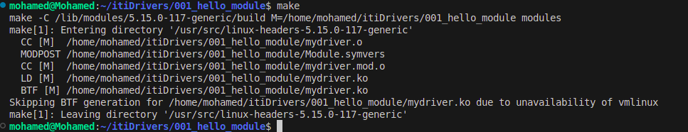

# Implement (proc file system)

### 1. write kernel module

```c
#include <linux/cdev.h>
#include <linux/init.h>
#include <linux/module.h>
#include <linux/proc_fs.h>
#include <linux/uaccess.h> 

ssize_t mywrite(struct file *files, const char __user *buffer, size_t size, loff_t *loff);
ssize_t myread(struct file *files, char __user *buffer, size_t size, loff_t *loff);

struct proc_dir_entry *proc_dir;

const struct proc_ops proc_file_operations = {.proc_read = myread, .proc_write = mywrite};

ssize_t mywrite(struct file *files, const char __user *buffer, size_t size, loff_t *loff)
{
    printk("hello from write\n");
    return size;
}

ssize_t myread(struct file *files, char __user *buffer, size_t size, loff_t *loff)
{
    printk("hello from read\n");
    return 0;
}

static __init int mykernel_init(void)
{
    proc_dir = proc_create("google", 0666, NULL, &proc_file_operations);
    if (!proc_dir)
    {
        printk("Failed to create proc entry\n");
        return -ENOMEM;
    }
    printk("hello \n");
    return 0;
}

static __exit void mykernel_exit(void)
{
    proc_remove(proc_dir);
    printk(KERN_INFO "bye kernel\n");
}

module_init(mykernel_init);
module_exit(mykernel_exit);

MODULE_LICENSE("GPL");
```

- **Header Files**: Include necessary Linux kernel headers for the module’s functionality.
-    **Function Declarations**: Define the prototypes for the read and write operations.
-    **Global Variables**: Define and initialize variables and structures used by the module.
-    **Read/Write Functions**: Implement the functionality for reading from and writing to the proc file.
-    **Initialization/Cleanup**: Implement functions to set up and tear down the module.
-    **Metadata**: Provide information about the module.

This kernel module creates a simple `/proc` file entry named "google" that logs messages when read from or written to. The module’s functionality is minimal but provides a foundation for working with the /proc filesystem in kernel development.


### 2.Edit Include path in c-cpp-properties.json 

Include kernel headers path 

```json
{
  "configurations": [
    {
      "name": "linux-gcc-x64",
      "includePath": [
        "${workspaceFolder}/**",
        "/usr/src/linux-headers-5.15.0-117-generic/include/"
      ],
      "compilerPath": "/usr/bin/gcc",
      "cStandard": "c17",
      "cppStandard": "gnu++14",
      "intelliSenseMode": "linux-gcc-x64",
      "compilerArgs": [
        ""
      ]
    }
  ],
  "version": 4
}

```

### 3. build module 

Create Makefile in the same directory of the module 

```makefile
obj-m += mydriver.o

all:
	make -C /lib/modules/$(shell uname -r)/build M=$(shell pwd) modules

clean:
	make -C /lib/modules/$(shell uname -r)/build M=$(shell pwd) clean

```
run the command `make` in the terminal



Now we have created the proc but if we grep for it in the `/proc/google` it will not be found we have to insert the module first

To see the output of `printk()` use the command `dmesg` 


```
sudo insmod mydriver.ko
```
To remove module :

```
sudo rmmod mydriver.ko
```


if you try to cat or echo to the `/proc/google` we will use the operations add in the module read an write.

```
cat /proc/google 

echo 2 > /proc/google

```


