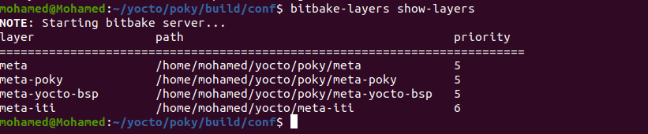
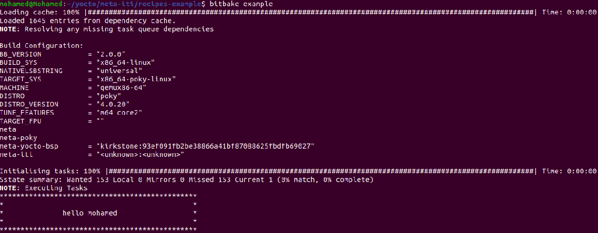

# Creating mylayer

First run `oe-init-build-env` script 
As it update the PATH and create my build enviroment 

``` 
source oe-init-build-env 
```
Now i have two options 

1) creating my layer from scratch by adding needed conf files and recipe 

2) By using this command `bitbake-layers create-layer ../meta-iti` that will create a template meta-layer


After Making mylayer (meta-iti) i need to add it in bblayers.conf

so the bitbake will see my layer

run the below command when we are in poky directory

```
bitbake-layers add-layer ../meta-iti
```
to check the layer in bblayers.conf

```
bitbake-layers show-layers
```



Inside the created layer there is recipes-example directory and in side it example and finally example_0.1.bb
we must make sure the Hierarchy of directories to be `recipes-package/package/package.bb`

we will edit example_0.1.bb

```
SUMMARY = "bitbake-layers recipe"
DESCRIPTION = "Recipe created by bitbake-layers"
LICENSE = "MIT"

python do_display_banner() {
    bb.plain("***********************************************")
    bb.plain("*                                             *")
    bb.plain("*              hello mohamed                  *")
    bb.plain("*                                             *")
    bb.plain("***********************************************")
}

addtask do_display_banner before do_build

```
save the file and run it with `bitbake example`


