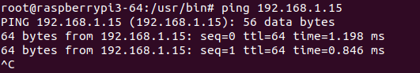
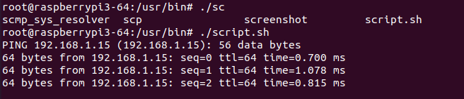

# Yocto task: Adding a Script/Application to a Custom Image for Raspberry Pi 3

we need to add  a script or application to my image on rasbperry pi 3. 
we will create our `DISTRO` and our `layer` and keep the hierarchy

the hierarchy of meta-iti layer  : 

```
mohamed@Mohamed:~/yocto/meta-iti$ tree
.
├── conf
│   ├── distro
│   │   └── almaza.conf
│   └── layer.conf
├── COPYING.MIT
├── README
├── recipes-example
│   └── example
│       └── example_0.1.bb
├── recipes-myimage
│   └── myimage
│       └── myimage.bb
├── recipes-myrecipe
│   └── myrecipe
│       ├── files
│       │   ├── main.c
│       │   └── myservice.service
│       ├── myrecipe.bb
│       └── myrecipe.bbappend
├── recipes-script
│   └── script
│       ├── files
│       │   └── script.sh
│       └── script_0.1.bb
└── recipes-service
    └── service
        └── service_0.1.bb

```
## Step 1: Creating a Recipe

### Recipe Overview

We will create a Yocto recipe that adds a script to the image. The script pings an IP address and controls a GPIO pin based on the result.
 

 ### Recipe File (script_0.1.bb)
```
SUMMARY = "Application to ping for IP and control GPIO"

DESCRIPTION = "This script pings an IP address and controls a GPIO pin based on the result."

  

LICENSE = "CLOSED"

  

FILES_PATH:append=" /home/mohamed/yocto/meta-iti/recipes-script/script/files"

  

SRC_URI = "file://script.sh"

  

do_install() {

install -d ${D}${bindir}

install -m 0755 ${WORKDIR}/script.sh ${D}${bindir}/script.sh

}

```

## Step 2: Creating the Script

### Script File (script.sh)

This script will run on the Raspberry Pi 3:

```bash 
#!/bin/sh

  

PIN_NUMB=17 # change this to your required pin on rpi 3 

IP_ADDRESS=10.145.19.245 # Change this to your IP address

  

if [[ ! -d /sys/class/gpio/gpio${PIN_NUMB} ]]; then

echo ${PIN_NUMB} > /sys/class/gpio/export

sleep 1

echo "out" > /sys/class/gpio/gpio${PIN_NUMB}/direction

fi

sleep 1

if ping -c 3 "${IP_ADDRESS}"; then

echo 0 > /sys/class/gpio/gpio${PIN_NUMB}/value
else
echo 1 > /sys/class/gpio/gpio${PIN_NUMB}/value
fi

```

## Step 3: Build the Recipe

### Checking the Recipe

To ensure the recipe works without errors:
```
bitbake script
```

After running this command you will see the script in the dir specified in the recipe 

`${WORKDIR}/script.sh ${D}${bindir}/script.sh`

### Building the Image

After verifying the script, build the image to include the script:

```
bitbake -k core-image-sato 
```

## Step4: Flashing the Image to the SD Card

### Format the SD Card:
```
sudo dd if=/dev/zero of=/dev/mmcblk0 bs=4M
```
### Write the Image to the SD Card:
```
sudo dd if=/home/mohamed/yocto/poky/build/tmp-glibc/deploy/images/raspberrypi3-64
/core-image-sato-raspberrypi3-64.rpi-sdimg of=/dev/mmcblk0 bs=1M

```
## Step 5 : Running the Script on Raspberry Pi 3

1) **Connect TTL and Power**: 

```
sudo picocom -b 115200 /dev/ttyUSB0
```
2) Set a Static IP Address on the Raspberry Pi after connecting ethernet cable:

````
ip addr add 192.168.1.51/24 dev eth0
````
3) Set a Static IP Address on Your Device:

```
sudo ip addr add 192.168.1.15/24 dev enp1s0 
```

**Ensure that the subnet matches between your device and the Raspberry Pi.**


## Step 6 : Testing the Script 

After running the script, it pings your device and turns off the LED based on the ping result.

Run the command to check that it is working correctly 




After running script it ping for my device and turn off the led 




